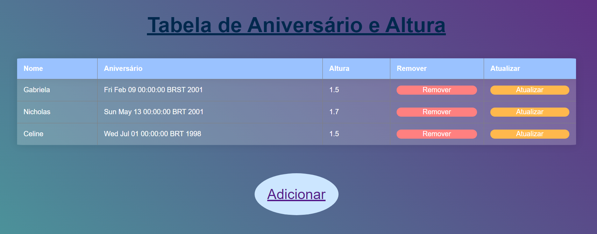
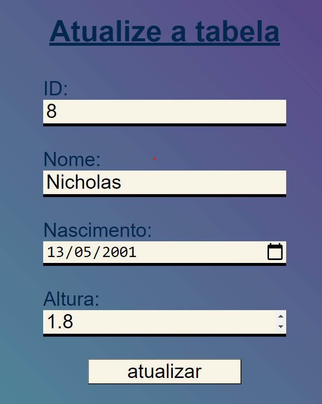
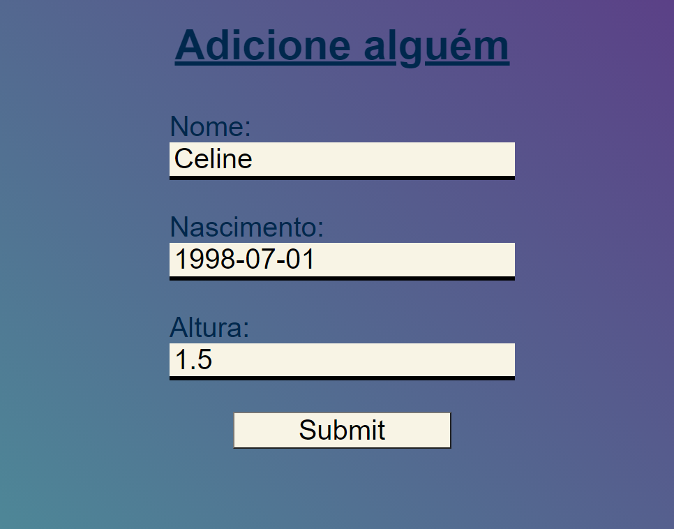

# TecWeb-Projeto1

O projeto consiste na construção de um sitema de anotações e mini-posts, focado no fluxo do usuário, sequência lógica de entrada e exibição de dados.

O Database a ser utilizado contém informações sobre a data de aniversário altura de pessoas. A tabela pode ser modificada, sendo possível a adição, remoção e edição dos dados.

Para a execução desse projeto, é necessário inicialmente criar um database no mysql, o qual foi dado o nome de "meus_dados" na codificação. Logo, no termimal deve ser digitado:
- CREATE DATABASE meus_dados;
- USE meus_dados;
- CREATE TABLE Pessoa (id INT NOT NULL AUTO_INCREMENT, nome VARCHAR(32) NOT NULL, nascimento DATE, altura DECIMAL (2, 1), PRIMARY KEY (ID));

Agora, pode-se inserir na tabela de início algum registro, com o seguinte comando, por exemplo:
- INSERT INTO Pessoa (nome, nascimento, altura) VALUES ('Gabriela','20010209',1.5);

A fim de conseguir visualizar o resultado final, é necessário adicionar na URL "Lista": http://localhost:8080/Projeto1/Lista

Assim, a página deve ficar no seguinte formato:

Pode-observar a existência de três botões: "Remover" e "Atualizar" ao lado de cada registro e "Adicionar" abaixo a tabela

Ao clicar em "Remover", o registro da mesma linha será deletado.
O botão atualizar direcionará o usuário à possibilidade de edição dos dados do registro:

Já ao clicar ek "Adicionar", será possível realizar mais um registro na tabela e o formato deve ser, por exemplo, da seguinte maneira:

